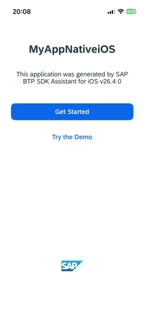
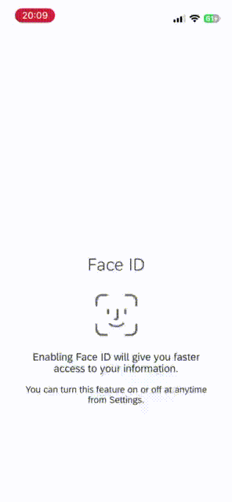
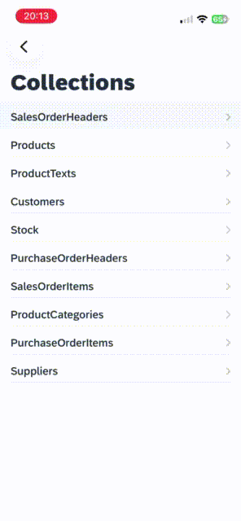
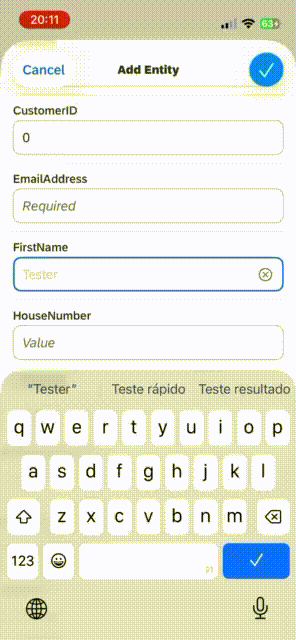
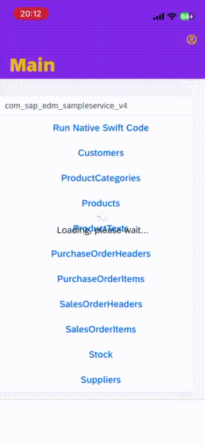

# SAP BTP SDK for iOS + Reused MDK OData (ESPM) Study

<a href="https://www.sap.com/products/try-sap/trials-downloads.html?search=sdk%20for%20ios">
  SAP BTP SDK Assistant for iOS v. 26.4.0
</a>

| Sing in |
|--------|
|  |

## Objective
This project aims to explore how to reuse an existing OData service (ESPM) — originally configured for an SAP MDK application — within a fully native iOS application built using the SAP BTP SDK for iOS.

Key focus areas:

- Reuse of backend services across different SAP mobile technologies  
- Manual configuration of Mobile Services  
- Metadata handling for OData consumption  
- UI implementation using SAP Fiori (UIKit-based)  
- Experimentation with SwiftUI inside a UIKit-based framework  

---

## Extra Insight
Unlike SAP MDK, which abstracts most backend and metadata configuration, the SAP BTP SDK for iOS requires:

- Explicit Mobile Services configuration  
- Manual metadata provisioning  
- Deeper understanding of OData structure  

This study highlights the **hidden complexity behind "native control"**, especially when reusing an existing backend.

| Update | SwiftUI | FioriUI | Add Tester iOS| Read Tester MDK|
|--------|------|--------|--------|--------|
|  |  |  |  |  |

---

## Overview
This project reuses the **Mobile Sample OData (ESPM)** service that was previously configured for an SAP MDK application.

To make it work with a native iOS app:

1. A new Mobile Service (`qwerty`) was created manually  
2. Connectivity settings were replicated from the MDK Mobile Service  
3. Metadata had to be manually uploaded  
4. The app was generated using SAP BTP SDK Assistant  

Additionally, UI experiments were conducted using SwiftUI within a UIKit-based SAP Fiori environment.

---

## About
The project uses:

- SAP BTP SDK for iOS (native Swift development)  
- SAP Mobile Services (manual configuration)  
- OData (ESPM) reused from MDK setup  
- SAP Fiori for iOS (UIKit-based UI framework)  

This creates a contrast between:

- Metadata-driven MDK approach  
vs  
- Code-driven native iOS approach  

---

## Scope of This Implementation
This implementation includes:

- Creation of a new Mobile Service (`qwerty`)  
- Manual configuration of connectivity to reused OData endpoint  
- Manual upload of metadata for OData model recognition  
- Native iOS project generation via SAP BTP SDK Assistant  
- UI implementation using SAP Fiori components  
- Experimental use of SwiftUI within UITableView  

---

## Feature Implemented

### Reuse of Existing OData (ESPM)
- Same backend used by MDK project  
- Connectivity manually replicated  
- Ensures consistency across applications  

---

### Manual Metadata Injection
- Metadata file uploaded via SAP BTP app  
- Required because the service was reused (not auto-generated)  
- Enabled proper entity mapping in the SDK  

---

### SwiftUI Inside UITableView (Experimental)
- Attempted to use SwiftUI for layout inside table view cells  
- Used:

```swift
UIHostingConfiguration
```

- Limitations:
    - Not fully compatible with SAP Fiori (UIKit-based)
    - Layout inconsistencies observed

- Final decision:
    - Reverted to SAP Fiori native components for stability

## Improvements Over the Original Tutorial

| Area | Original Approach | This Implementation |
|------|----------------|-------------------|
| OData Setup | Auto-configured | Reused from MDK |
| Mobile Services | Single service | Custom service (`qwerty`) |
| Metadata | Automatic | Manual upload |
| UI Framework | SAP Fiori | Fiori + SwiftUI experiment |
| Architecture Insight | Basic | Deep integration understanding |

---

## Goals of This Study

- Understand how to reuse OData services across MDK and native SDK  
- Explore Mobile Services configuration manually  
- Validate metadata dependency in native SDK  
- Experiment with SwiftUI inside SAP Fiori apps  
- Identify limitations of mixing UI frameworks  

---

## Contributions

This project provides:

- A real-world example of reusing MDK backend in native iOS  
- Practical insight into Mobile Services configuration  
- A reference for handling metadata manually  
- Lessons learned from SwiftUI + UIKit interoperability  
- A comparison between abstraction (MDK) and control (native SDK)  

---

## References

- Fiori for iOS  
https://help.sap.com/doc/f53c64b93e5140918d676b927a3cd65b/Cloud/en-US/docs-en/guides/features/fiori-ui/overview.html  

- Using the Mobile Sample Service (ESPM)  
https://help.sap.com/doc/f53c64b93e5140918d676b927a3cd65b/Cloud/en-US/docs-en/guides/features/backend-connectivity/common/sample.html  

---

## Final Thoughts

This study reinforces an important architectural insight:

> Reusability at backend level does not imply simplicity at client level.

While the same OData service was reused:

- MDK handled everything transparently  
- Native SDK required explicit configuration and deeper control  

Also:

- Mixing SwiftUI with UIKit (SAP Fiori) is possible, but not always practical  
- Stability and consistency still favor using the native framework (Fiori)  

---

## Next Steps (Future Tests)

- Evaluate full SwiftUI adoption without SAP Fiori  
- Implement Offline OData support manually  
- Compare performance between MDK vs Native SDK  
- Explore deeper customization of Fiori components  
- Test advanced native integrations (camera, biometrics, NFC)  