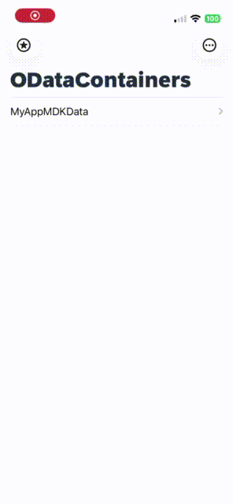
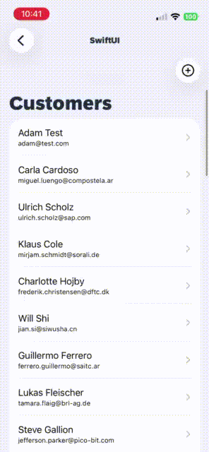
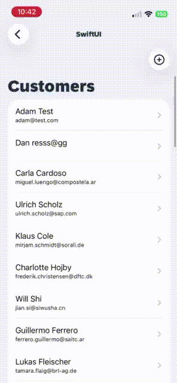
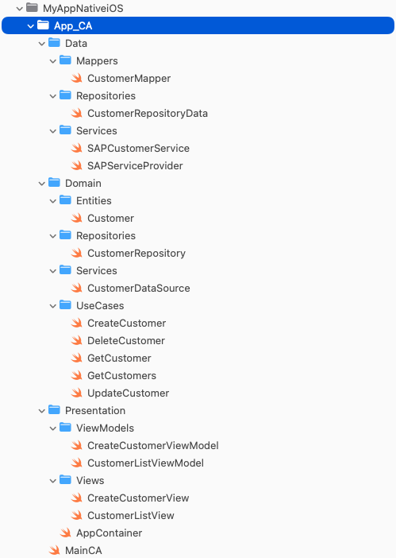
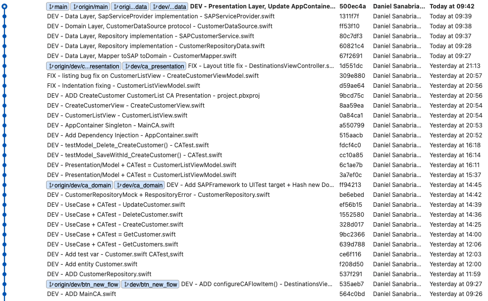

# 🚀 SAP Native iOS — Clean Architecture + CRUD Evolution

<a href="https://www.sap.com/products/try-sap/trials-downloads.html?search=sdk%20for%20ios">
  SAP BTP SDK Assistant for iOS v. 26.4.0
</a>

| Sing in |
|--------|
|  |

## 🚀 Part 1 — SAP BTP SDK for iOS + Reused MDK OData (ESPM) Study

Check the first step of this project:

👉 [README_pt1.md](./README_pt1.md)

## 🧠 Motivation

The original project generated by SAP BTP SDK Assistant provides a solid starting point.

However, it lacks:

- clear separation of concerns
- scalability patterns
- testability structure

To address that, I extended the app by applying:

✅ Clean Architecture  
✅ Repository Pattern  
✅ Use Case layer  
✅ Dependency Injection  
✅ Full CRUD implementation  

---

| SwiftUI | Create | Update |
|--------|--------|--------|
|  |  |  |

## 🏗️ Architecture Overview

The project was refactored into three main layers:

### 1. Presentation

- SwiftUI Views
- ViewModels
- State management

### 2. Domain

- Entities
- UseCases (business rules)
- Repository protocols

### 3. Data

- SAP Service integration
- Repository implementations
- Mappers (OData → Domain)

---

## 📁 Project Structure



---

## 🔄 Data Flow

```
View → ViewModel → UseCase → Repository → SAP Service
```

---

## ⚙️ Implemented Features

### CRUD - Customer

- ✅ Create Customer
- ✅ Get Customers (list)
- ✅ Get Customer (details)
- ✅ Update Customer
- ✅ Delete Customer

---

## 🧩 Key Design Decisions

### 🔹 Repository Pattern

Decouples:
- SAP SDK
- Business logic

---

### 🔹 Use Cases

Each operation is isolated:

- `CreateCustomer`
- `GetCustomers`
- `UpdateCustomer`
- `DeleteCustomer`

---

### 🔹 Mapper Layer

Responsible for translating:

```
SAP OData Entity ↔ Domain Entity
```
---

### 🔹 Dependency Injection

Centralized via:

```
AppContainer.swift
```

---

## 📈 Development Timeline



This timeline shows:
- incremental evolution
- architectural decisions
- separation of responsibilities

---

## 💡 Key Learnings

- SAP SDK can be adapted to modern architectures
- Clean Architecture improves testability significantly
- SwiftUI works well with UseCase-driven flows
- Separation of concerns reduces coupling with SAP services

---

## 🚀 Next Steps

- Offline-first improvements
- Introduce Combine / AsyncStream
- Pagination support

---

## 🤝 Contributions & Feedback

Feel free to open issues or suggestions.

---

## 👨‍💻 Author

Daniel Sanabria
---

## References

- Clean Architecture, developed by Robert C. Martin (Uncle Bob)